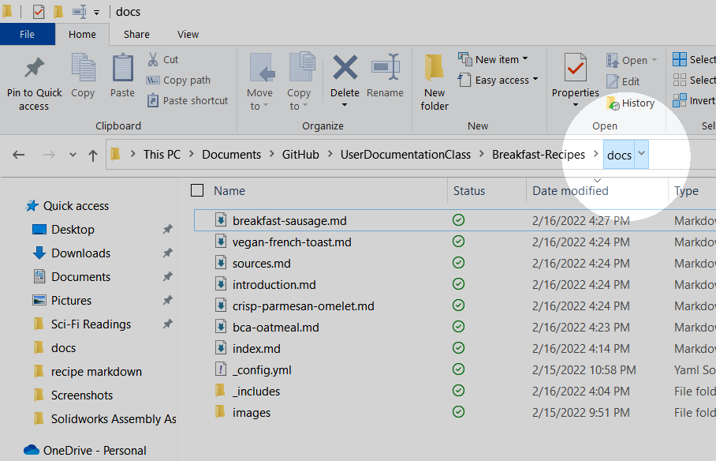
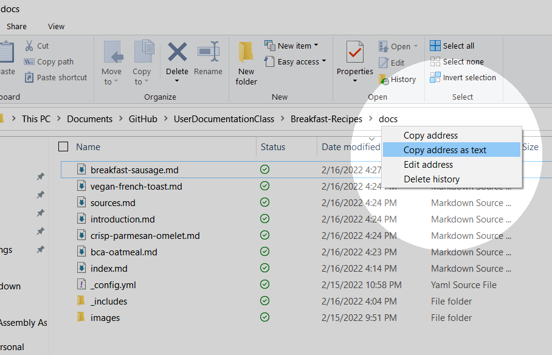

# How to Convert Markdown to Word

This guide will walk new Pandoc users through converting their first Markdown file `.md` into a Word file `.docx`.  

## Prerequisites

- A working installation of Pandoc
- A Markdown file to be converted

## Tools

- The Command Prompt

## Steps

1. Locate your Markdown file in your computer.
1. Right-click the last folder of the file path. _See figure 1._
    <figure>
    
    <figcaption>Figure 1</figcaption>
    </figure>
1. Left-click the "Copy Address as text" option. _See figure 2._
    <figure>
    
    <figcaption>Figure 2</figcaption>
    </figure>
1. Open the command prompt.  
    > Tip: The command prompt can easily be found by searching it using the "search" tool in the taskbar of any Windows machine.
1. Type `cd Z` into the prompt.
1. Replace `Z` by pasteing the file path using CTRL-V.
1. Press the ENTER key to enter the command.
    > The command prompt has moved along the file path you have given it.  
    > If you think you have moved into the wrong path, copy the correct address and repeat the steps above.
1. Type `pandoc -f markdown -o output.docx Z.md` into the prompt.
1. Replace `Z` with the name of your markdown file.
    > Tip: If your markdown file name has spaces in the name, surround it in quotation marks like this, `"example of spaces.md"`.  
    > Tip: You can also replace `output` with any name you want.
1. Press the ENTER key to enter the command.

## Results

You should have a Word file with the `.docx` file extension.  
Make sure to examine your file for any errors in the conversion.


