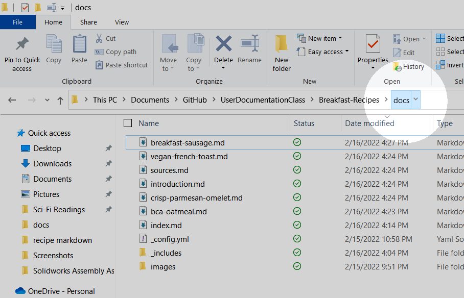
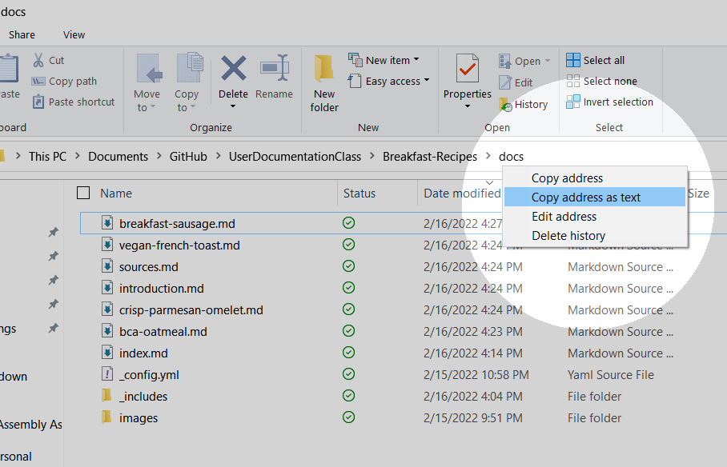

# How to Convert Word to Markdown

Goal goal goal

## Prerequisites

- A working installation of Pandoc
- A Word file to be converted

## Tools

- The Command Prompt

## Steps

1. Locate your Word file in your computer.
1. Right-click the last folder of the file path. _See figure 1._
    <figure>
    
    <figcaption>Figure 1</figcaption>
    </figure>
1. Click the "Copy Address as text" option. _See figure 2._
    <figure>
    
    <figcaption>Figure 2</figcaption>
    </figure>
1. Open the command prompt.  
    > The command prompt can easily be found by searching it using the "search" tool in the taskbar of any Windows machine.
1. Type `cd Z` into the prompt.
1. Replace `Z` by pasteing the file path using CTRL-V.
1. Press the ENTER key.
1. Type `pandoc -s Z.docx -t markdown --extract-media=images -o output.md` into the prompt.
1. Replace `Z` with the name of your word file.  
    > Tip: If your word file name has spaces in the name, surround it in quotation marks like this, `"example of spaces.md"`.  
    > Tip: You can also replace `output` with any name you want.
1. Press the ENTER key.

## Results

You should have a converted Markdown file with the `.md` file extension.  
You should also have a folder that includes any images from the Word file.  
Make sure to examine your file for any errors in the conversion.


